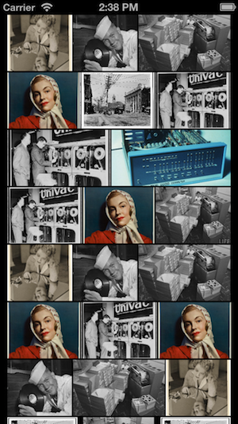
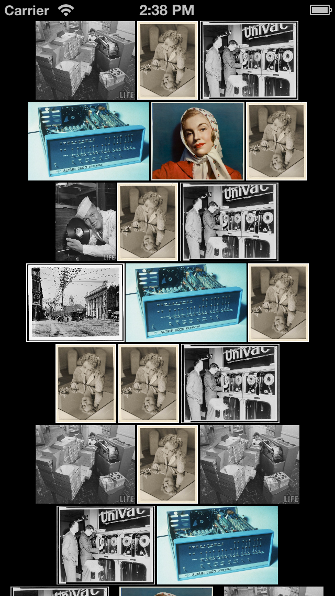

# SGSStaggeredFlowLayout

UICollectionViewFlowLayout subclass for staggering cells.

## Screenshots

SGSStaggeredFlowLayoutMode_Even:

 

SGSStaggeredFlowLayoutMode_Centered:



## Instructions

#### Install
Available on CocoaPods, simply add to your Podfile:

```
pod "SGSStaggeredFlowLayout"
```

then do a 'pod install'

#### Code

(See example for full source)

``` objective-c
_flowLayout = [[SGSStaggeredFlowLayout alloc] init];
_flowLayout.layoutMode = SGSStaggeredFlowLayoutMode_Even;
_flowLayout.minimumLineSpacing = 2.0f;
_flowLayout.minimumInteritemSpacing = 2.0f;
_flowLayout.sectionInset = UIEdgeInsetsMake(0.0f, 10.0f, 0.0f, 10.0f);
_flowLayout.itemSize = CGSizeMake(75.0f, 75.0f);

self.internalCollectionView.collectionViewLayout = _flowLayout;
```

## Contact

PJ Gray

- http://github.com/pj4533
- http://twitter.com/pj4533
- pj@pj4533.com

## License

SGSStaggeredFlowLayout is available under the MIT license. See the LICENSE file for more info.

